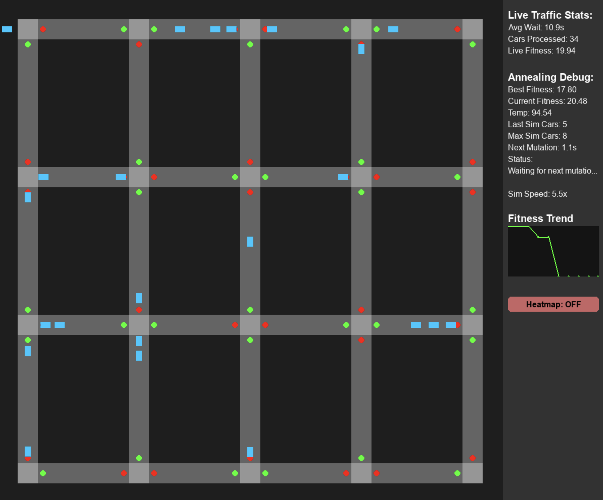

# AI-Traffic-Simulator

A visual traffic simulation and optimization system that models vehicle flow through a small urban grid of intersections. It uses **Simulated Annealing**, a probabilistic optimization algorithm, to iteratively improve traffic light timing strategies with the goal of reducing congestion, minimizing vehicle wait times, and increasing overall throughput.

The system simulates realistic traffic behavior, tracks congestion levels, and visually demonstrates the impact of each optimization step in real time.



## Getting Started

Follow these steps to set up and run the project locally.

### Prerequisites

- Python 3.x installed on your system ([Download Python](https://www.python.org/downloads/))

### Setup Instructions

1. **Clone the Repository**
   `git clone https://github.com/crfloyd/AI-Traffic-Simulator`  
   `cd AI-Traffic-Simulator`

2. **Create a Virtual Environment**
   `python -m venv venv`

3. **Activate the Virtual Environment**

   - On Windows:

     ```bash
     venv\Scripts\activate
     ```

   - On macOS/Linux:

     ```bash
     source venv/bin/activate
     ```

4. **Install Dependencies**

   ```bash
   pip install -r requirements.txt
   ```

5. **Run the Application**

   ```bash
   python main.py
   ```

---

### Deactivating the Virtual Environment

When you're done, run the following command to exit the virtual environment:

```bash
deactivate
```
